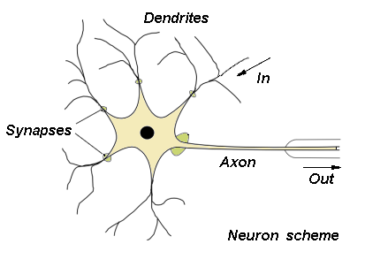
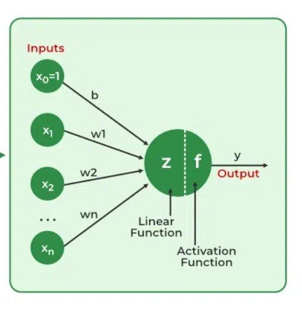

Neural networks are computational models that mimic the complex functions of the human brain. They consist of interconnected nodes, or neurons, that process and learn from data, enabling tasks such as pattern recognition and decision-making in machine learning.

Human neuron scheme (protoplast of Rosenblatt's perceptron) 

# What are Neural Networks?
Neural networks are computational models that extract identifying features from data without relying on pre-programmed understanding. 
Key components of a neural network include neurons, connections, weights, biases, propagation functions, and learning rules. 
Neurons receive inputs, which are adjusted by thresholds and activation functions. 
Connections consist of weights and biases that regulate the flow of information between neurons. 
Learning occurs through the adjustment of these weights and biases in three key stages: processing input data, generating output, and iteratively refining the network to improve its performance in various tasks.

The process involves the following:
* A neural network is simulated in a given environment.
* As a result of this simulation, the network's free parameters are adjusted.
* The neural network then responds differently to the environment due to the changes in its parameters, enhancing its ability to learn and adapt to new information.

 
This adaptive process allows neural networks to evolve and improve their accuracy in solving complex tasks like pattern recognition, decision-making, and data processing.

# Evolution of Neural Networks
Since the 1940s, significant advances have been made in the field of neural networks:
* **1940s–1950s: Early Concepts**:
Neural networks began with the introduction of the first mathematical model of artificial neurons by McCulloch and Pitts. However, computational limitations at the time slowed further progress.

* **1960s–1970s: Perceptrons**:
This era was defined by Rosenblatt's work o
* n perceptrons, which were single-layer networks with applications limited to linearly separable problems.

* **1980s: Backpropagation**:
Training multi-layer networks became possible with the invention of the backpropagation method. Emphasizing learning through interconnected nodes.

* **1990s: Boom and Winter**:
Neural networks flourished with applications in image recognition, finance, and other fields. However, the field experienced a "winter" due to high computational costs and unmet expectations.

* **2000s: Revival and Deep Learning**:
Larger datasets, innovative architectures, and improved computational capabilities led to a resurgence. Deep learning showed remarkable effectiveness across many disciplines, utilizing multiple layers.

* **2010s–Present: Dominance of Deep Learning**:
Convolutional neural networks (CNNs), recurrent neural networks (RNNs), transformer, deep learning architectures, have come to dominate machine learning. Their power has been demonstrated through innovations in gaming, image recognition, and natural language processing.

  
Based on:
* https://www.geeksforgeeks.org/neural-networks-a-beginners-guide/
* https://home.agh.edu.pl/~vlsi/AI/intro/