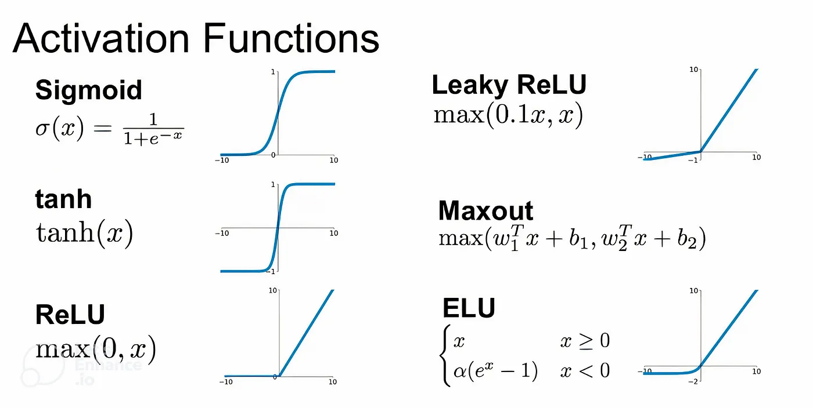

# Activation Functions
Activation functions are the mathematical operations that determine how a node in a neural network propagates information to the next layer.

Without activation functions, neural networks would be linear models, which are only able to learn simple linear relationships between the input and output data. Activation functions allow neural networks to learn more complex non-linear relationships, which is why they are so powerful and versatile.

Here are some of the most known activation functions along with their graphs: 
 
Each of these functions has specific advantages, shortcomings, and applications.