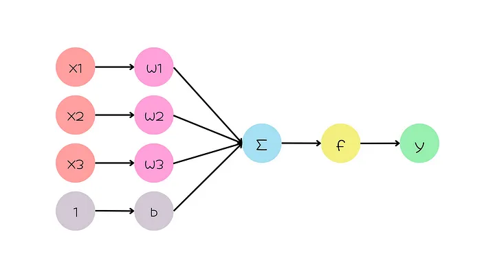

To understand how neural networks work, we need to start with the perceptron, the basic building block of all neural networks.

# Perceptron
A perceptron is a simple artificial neuron that mimics the function of a biological neuron. It takes a set of inputs, multiplies each input by a weight, adds a bias term, and then sums everything together. This weighted sum is then passed through an activation function, which produces the output of the perceptron. 
 
x1, x2, and x3 are the inputs, w1, w2, and w3 are the weights, b is the bias, and y is the output

# ANN Architecture
Artificial Neural Networks (ANNs) are basically networks of perceptrons. They contain an input layer, hidden layers, and output layers.
 
The parameters in ANNs are the weights and biases. The weights determine how much influence each input has on the output of the perceptron. The biases are added to the weighted sum of the inputs before the activation function is applied.

# Training an ANN
ANN has parameters (weights and biases) and hyperparameters (nodes, layers, optimizers, learning rate, batch size, epoch, activation functions, cost function).

Parameters are the values that the model learns during training to minimize the error between its predictions and the actual labels. So we don’t decide these values for the model.

Hyperparameters, on the other hand, are set by us before training and remain constant throughout the training process.

ANNs are trained by feeding them a set of training data, which consists of input-output pairs. The ANN then learns to adjust its weights and biases so that it can produce the correct outputs for the given inputs.

The algorithm consists of two main steps: a forward step (forward method) and a backward step (backpropagation method).
The train method iterates for a certain number of epochs. At each epoch, it performs the forward method and then the backpropagation gradient method.
Various metrics (e.g., accuracy and mse) are calculated using test data, from which the learning of the network is evaluated.

Based on:
* https://medium.com/@ja_adimi/neural-networks-101-a-gentle-introduction-3caf9c99e23f